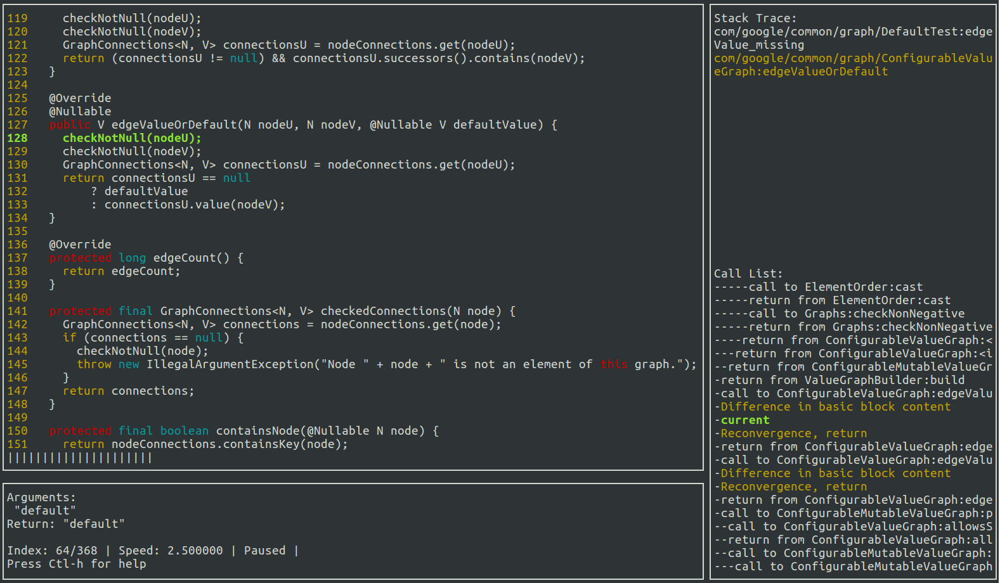

# VeDebug

VeDebug is the first video-based time-travel regression debugging tool
to advance users' debugging experience. VeDebug introduces two unique
features: (1) regression debugging, i.e., setting a "divergence
breakpoint" (which "breaks" the execution whenever the control flow of
the current execution diverges from the flow of a previously captured
execution), and (2) video debugging, which provides features similar
to those of a video player (e.g., speed up/slow down the replay). The
demo video for VeDebug can be found at:
<https://www.youtube.com/watch?v=lOiGrE_sc10>.

The screenshot shows VeDebug debugging environment: current statement
and context (top-left), argument values and video status
(bottom-left), current stack trace (top-right), and execution trace
and the current position in the trace (bottom-right).
    


## Citation

If you use VeDebug in your research, we request you to cite our
[ICSE'22 Demo
paper](https://cptgit.github.io/dl/papers/BuhseETAL19VeDebug.pdf).
Thank you!

```bibtex
@inproceedings{bushe19vedebug,
  author = {Buhse, Ben and Wei, Thomas and Zang, Zhiqiang and Milicevic, Aleksandar and Gligoric, Milos},
  title = {{VeDebug}: Regression Debugging Tool for {J}ava},
  booktitle = {International Conference on Software Engineering, Tool Demonstrations Track},
  pages = {15--18},
  year = {2019},
  doi = {10.1109/ICSE-Companion.2019.00027}
}
```
